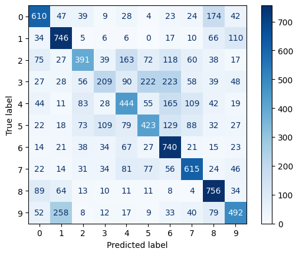
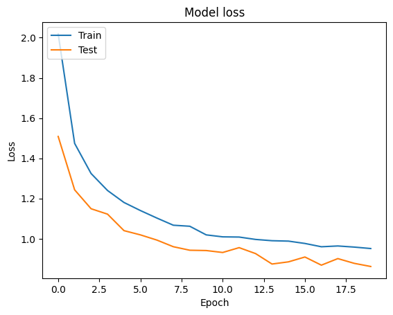
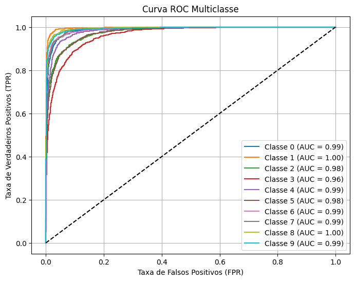
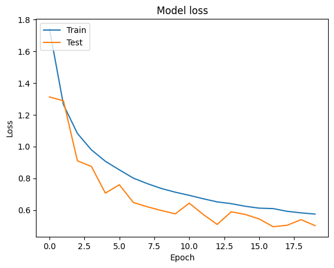
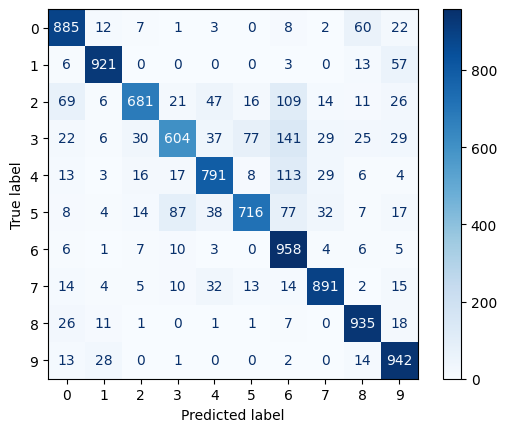
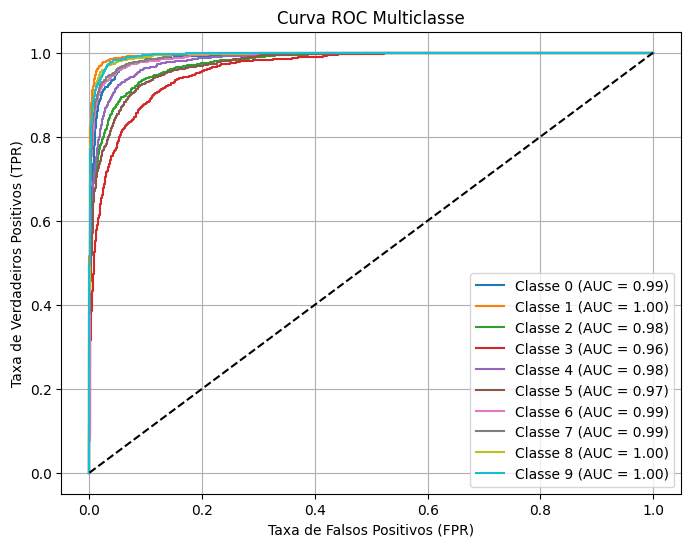

# Relatório CIFAR-10

## Autores: Gabriel de Sousa e Suellen Oliveira

### Modelo Inicial: lenet_5

```python
def CNN_model(input_shape=(32, 32, 3), num_classes=10):
  model = Sequential()
  model.add(Conv2D(6, kernel_size=(5, 5), activation='tanh', input_shape=input_shape))
  model.add(AvgPool2D(pool_size=(2, 2), strides=(2, 2)))
  model.add(Conv2D(16, kernel_size=(5, 5), activation='tanh'))
  model.add(AvgPool2D(pool_size=(2, 2), strides=(2, 2)))
  model.add(Conv2D(120, kernel_size=(5, 5), activation='tanh'))

  model.add(Flatten())
  model.add(Dense(84, activation='tanh'))
  model.add(Dense(num_classes, activation='softmax'))

  model.compile(loss='categorical_crossentropy', optimizer='adam', metrics=['accuracy'])
  return model
```

## Curva de Aprendizado


## Matriz de Confusão


## F1-score, Recall e Precision
> Recall:  0.5227

> Precision:  0.5167

> F1 Score:  0.5197

## Curva ROC (com a AUC)


### Modelo melhorado: Implementando Dropout

```python
def model1(input_shape=(32, 32, 3), num_classes=10):
  model = Sequential()
  model.add(Conv2D(6, kernel_size=(5, 5), activation='tanh', input_shape=input_shape))
  model.add(AvgPool2D(pool_size=(2, 2), strides=(2, 2)))
  model.add(Dropout(0.25))

  model.add(Conv2D(16, kernel_size=(5, 5), activation='tanh'))
  model.add(AvgPool2D(pool_size=(2, 2), strides=(2, 2)))
  model.add(Conv2D(120, kernel_size=(5, 5), activation='tanh'))
  model.add(Dropout(0.25))

  model.add(Flatten())
  model.add(Dense(84, activation='tanh'))
  model.add(Dense(num_classes, activation='softmax'))

  model.compile(loss='categorical_crossentropy', optimizer='adam', metrics=['accuracy'])
  return model
```

## Curva de Aprendizado


## Matriz de Confusão


## F1-score, Recall e Precision
> Recall:  0.5426

> Precision:  0.5356

> F1 Score:  0.5391

## Curva ROC (com a AUC)


### Modelo melhorado: Mudando alguns parâmetros

```python
def model2(input_shape=(32, 32, 3), num_classes=10):
  model = Sequential()
  model.add(Conv2D(64, kernel_size=(3, 3), activation='tanh', input_shape=input_shape))
  model.add(Conv2D(64, kernel_size=(3, 3), activation='tanh', input_shape=input_shape))
  model.add(MaxPool2D(pool_size=(2, 2)))
  model.add(Dropout(0.4))

  model.add(Conv2D(128, kernel_size=(3, 3), activation='tanh'))
  model.add(Conv2D(128, kernel_size=(3, 3), activation='tanh'))
  model.add(MaxPool2D(pool_size=(2, 2)))
  model.add(Dropout(0.4))

  model.add(Flatten())
  model.add(Dense(1024, activation='tanh'))
  model.add(Dense(1024, activation='tanh'))
  model.add(Dense(num_classes, activation='softmax'))

  model.compile(loss='categorical_crossentropy', optimizer='adam', metrics=['accuracy'])
  return model
```

## Curva de Aprendizado


## Matriz de Confusão


## F1-score, Recall e Precision
> Recall:  0.7099

> Precision:  0.7258

> F1 Score:  0.7177

## Curva ROC (com a AUC)


### Modelo melhorado: Adicionando camadas e ajustando parametros

```python
def model3(input_shape=(32, 32, 3), num_classes=10):
  model = Sequential()
  model.add(Conv2D(32, kernel_size=(3, 3), activation='tanh', kernel_initializer="he_uniform", padding="same", input_shape=input_shape))
  model.add(Conv2D(32, kernel_size=(3, 3), activation='tanh', kernel_initializer="he_uniform", padding="same"))
  model.add(MaxPool2D(pool_size=(2, 2)))
  model.add(Dropout(0.2))

  model.add(Conv2D(64, kernel_size=(3, 3), activation='tanh', kernel_initializer="he_uniform", padding="same"))
  model.add(Conv2D(64, kernel_size=(3, 3), activation='tanh', kernel_initializer="he_uniform", padding="same"))
  model.add(MaxPool2D(pool_size=(2, 2)))
  model.add(Dropout(0.3))

  model.add(Conv2D(128, kernel_size=(3, 3), activation='tanh', kernel_initializer="he_uniform", padding="same"))
  model.add(Conv2D(128, kernel_size=(3, 3), activation='tanh', kernel_initializer="he_uniform", padding="same"))
  model.add(MaxPool2D(pool_size=(2, 2)))
  model.add(Dropout(0.4))

  model.add(Flatten())
  model.add(Dense(128, activation='tanh', kernel_initializer="he_uniform"))
  model.add(Dropout(0.5))
  model.add(Dense(num_classes, activation='softmax'))

  model.compile(loss='categorical_crossentropy', optimizer='adam', metrics=['accuracy'])
  return model
```

## Curva de Aprendizado


## Matriz de Confusão


## F1-score, Recall e Precision
> Recall:  0.7017

> Precision:  0.7123

> F1 Score:  0.7069

## Curva ROC (com a AUC)


### Modelo melhorado: Adicionando BatchNormalization e usando RELU como ativação

```python
def model4(input_shape=(32, 32, 3), num_classes=10):
  model = Sequential()
  model.add(Conv2D(32, kernel_size=(3, 3), activation='relu', kernel_initializer="he_uniform", padding="same", input_shape=input_shape))
  model.add(BatchNormalization())
  model.add(Conv2D(32, kernel_size=(3, 3), activation='relu', kernel_initializer="he_uniform", padding="same"))
  model.add(BatchNormalization())
  model.add(MaxPool2D(pool_size=(2, 2)))
  model.add(Dropout(0.2))

  model.add(Conv2D(64, kernel_size=(3, 3), activation='relu', kernel_initializer="he_uniform", padding="same"))
  model.add(BatchNormalization())
  model.add(Conv2D(64, kernel_size=(3, 3), activation='relu', kernel_initializer="he_uniform", padding="same"))
  model.add(BatchNormalization())
  model.add(BatchNormalization())
  model.add(Conv2D(64, kernel_size=(3, 3), activation='relu', kernel_initializer="he_uniform", padding="same"))
  model.add(BatchNormalization())
  model.add(MaxPool2D(pool_size=(2, 2)))
  model.add(Dropout(0.3))

  model.add(Conv2D(128, kernel_size=(3, 3), activation='relu', kernel_initializer="he_uniform", padding="same"))
  model.add(BatchNormalization())
  model.add(Conv2D(128, kernel_size=(3, 3), activation='relu', kernel_initializer="he_uniform", padding="same"))
  model.add(BatchNormalization())
  model.add(MaxPool2D(pool_size=(2, 2)))
  model.add(Dropout(0.4))

  model.add(Flatten())
  model.add(Dense(128, activation='relu', kernel_initializer="he_uniform"))
  model.add(BatchNormalization())
  model.add(Dropout(0.5))
  model.add(Dense(num_classes, activation='softmax'))

  model.compile(loss='categorical_crossentropy', optimizer='adam', metrics=['accuracy'])
  return model
```

## Curva de Aprendizado


## Matriz de Confusão


## F1-score, Recall e Precision
> Recall:  0.8484

> Precision:  0.8482

> F1 Score:  0.8483

## Curva ROC (com a AUC)


### Modelo melhorado: Adicionando Data-Augmentation

```python
def data_augmentation(X_train, y_train, batch_size=32):
  from tensorflow.keras.preprocessing.image import ImageDataGenerator

  train_datagen = ImageDataGenerator(width_shift_range=0.1,
                                     height_shift_range=0.1,
                                     horizontal_flip=True,
                                     rotation_range=20)

  return train_datagen.flow(X_train, y_train)
```

## Curva de Aprendizado


## Matriz de Confusão


## F1-score, Recall e Precision
> Recall:  0.8324

> Precision:  0.8405

> F1 Score:  0.8364

## Curva ROC (com a AUC)

