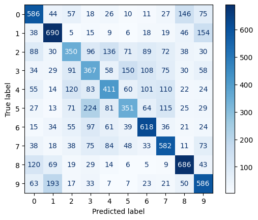
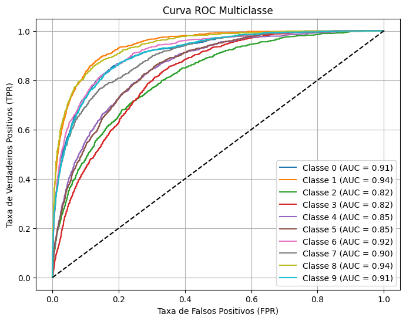
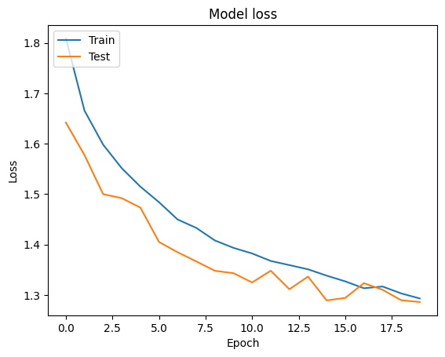

# Relatório CIFAR-10

## Autores: Gabriel de Sousa e Suellen Oliveira

### Modelo Inicial: lenet_5

```python
def CNN_model(input_shape=(32, 32, 3), num_classes=10):
  model = Sequential()
  model.add(Conv2D(6, kernel_size=(5, 5), activation='tanh', input_shape=input_shape))
  model.add(AvgPool2D(pool_size=(2, 2), strides=(2, 2)))
  model.add(Conv2D(16, kernel_size=(5, 5), activation='tanh'))
  model.add(AvgPool2D(pool_size=(2, 2), strides=(2, 2)))
  model.add(Conv2D(120, kernel_size=(5, 5), activation='tanh'))

  model.add(Flatten())
  model.add(Dense(84, activation='tanh'))
  model.add(Dense(num_classes, activation='softmax'))

  model.compile(loss='categorical_crossentropy', optimizer='adam', metrics=['accuracy'])
  return model
```

## Curva de Aprendizado


## Matriz de Confusão


## F1-score, Recall e Precision
> Recall:  0.5227

> Precision:  0.5167

> F1 Score:  0.5197

## Sensibilidade(TPR) e Especifidade(TNR)

## Acurácia ponderada e Curva ROC (com a AUC)


### Modelo Melhorado: (resnet-50)

```python
def conv_block(x, filters, kernel_size, strides, padding='same'):
    x = Conv2D(filters=filters, kernel_size=kernel_size, strides=strides, padding=padding)(x)
    x = BatchNormalization()(x)
    x = Activation('relu')(x)
    return x

def identity_block(x, filters):
    shortcut = x
    x = conv_block(x, filters=filters, kernel_size=(1, 1), strides=(1, 1))
    x = conv_block(x, filters=filters, kernel_size=(3, 3), strides=(1, 1))
    x = Conv2D(filters=filters * 4, kernel_size=(1, 1))(x)
    x = BatchNormalization()(x)
    x = Add()([x, shortcut])
    x = Activation('relu')(x)
    return x

def projection_block(x, filters, strides):
    shortcut = x
    x = conv_block(x, filters=filters, kernel_size=(1, 1), strides=strides)
    x = conv_block(x, filters=filters, kernel_size=(3, 3), strides=(1, 1))
    x = Conv2D(filters=filters * 4, kernel_size=(1, 1))(x)
    x = BatchNormalization()(x)
    shortcut = Conv2D(filters=filters * 4, kernel_size=(1, 1), strides=strides)(shortcut)
    shortcut = BatchNormalization()(shortcut)
    x = Add()([x, shortcut])
    x = Activation('relu')(x)
    return x

def ResNet50(input_shape=(224, 224, 3), num_classes=1000):
    inputs = Input(shape=input_shape)
    
    # initial conv layer
    x = conv_block(inputs, filters=64, kernel_size=(7, 7), strides=(2, 2))
    x = MaxPooling2D(pool_size=(3, 3), strides=(2, 2), padding='same')(x)

    # conv block 1
    x = projection_block(x, filters=64, strides=(1, 1))
    x = identity_block(x, filters=64)
    x = identity_block(x, filters=64)

    # conv block 2
    x = projection_block(x, filters=128, strides=(2, 2))
    x = identity_block(x, filters=128)
    x = identity_block(x, filters=128)
    x = identity_block(x, filters=128)

    # conv block 3
    x = projection_block(x, filters=256, strides=(2, 2))
    x = identity_block(x, filters=256)
    x = identity_block(x, filters=256)
    x = identity_block(x, filters=256)
    x = identity_block(x, filters=256)
    x = identity_block(x, filters=256)

    # conv block 4
    x = projection_block(x, filters=512, strides=(2, 2))
    x = identity_block(x, filters=512)
    x = identity_block(x, filters=512)

    # global average pooling and dense layer
    x = GlobalAveragePooling2D()(x)
    outputs = Dense(num_classes, activation='softmax')(x)

    model = Model(inputs=inputs, outputs=outputs)
    model.compile(loss='categorical_crossentropy', optimizer='adam', metrics=['accuracy'])
    return model
```

## Curva de Aprendizado


## Matriz de Confusão


## F1-score, Recall e Precision
> Recall:  0.7159

> Precision:  0.7272

> F1 Score:  0.7215

## Sensibilidade(TPR) e Especifidade(TNR)

## Acurácia ponderada e Curva ROC (com a AUC)

